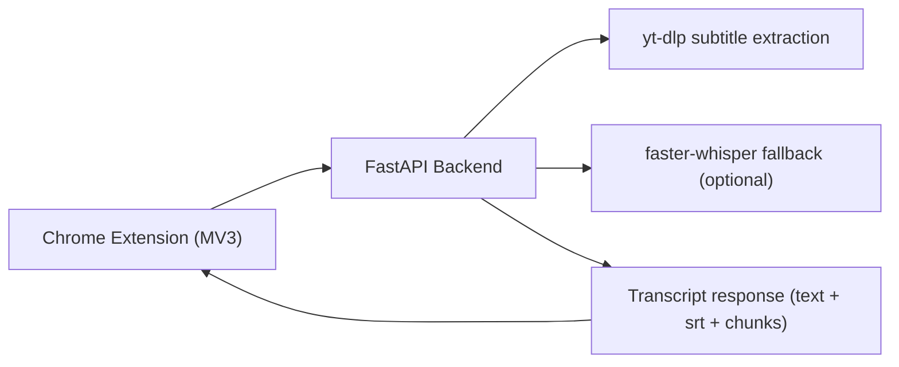

# Video Transcript MVP


Chrome extension + local FastAPI backend for converting video pages into transcript text.

## Features

- One-click transcript from the current browser tab.
- Subtitle-first strategy with `yt-dlp` for speed and lower compute cost.
- Optional local Whisper fallback (`faster-whisper`) when no subtitle is available.
- Export as plain text and SRT subtitle format.

## Architecture



## Repository Layout

- `backend/`: FastAPI service and transcript pipeline.
- `extension/`: Chrome extension popup UI.
- `docs/`: troubleshooting notes.

## Requirements

- Python 3.10+
- Chrome/Chromium
- `yt-dlp`
- `ffmpeg`

macOS install:

```bash
brew install yt-dlp ffmpeg
```

## Quick Start

### 1. Run backend API

```bash
cd /Users/claire/codex/video-transcript-mvp/backend
python3 -m venv .venv
source .venv/bin/activate
pip install -r requirements.txt
# Optional whisper fallback
pip install -r requirements-whisper.txt
uvicorn app:app --reload --host 127.0.0.1 --port 8001
```

Health check:

```bash
curl -s http://127.0.0.1:8001/health
```

### 2. Load extension in Chrome

1. Open `chrome://extensions`.
2. Enable `Developer mode`.
3. Click `Load unpacked`.
4. Select `/Users/claire/codex/video-transcript-mvp/extension`.

### 3. Generate transcript

1. Open a supported video page.
2. Click the extension icon.
3. Keep `API Base` as `http://127.0.0.1:8001`.
4. Click `Generate Transcript`.
5. Download `.txt` or `.srt`.

## API

`POST /api/transcript`

Request example:

```bash
curl -sS -X POST 'http://127.0.0.1:8001/api/transcript' \
  -H 'content-type: application/json' \
  -d '{"url":"https://www.bilibili.com/video/BV1xx411c7mD","language":"zh","fallback_transcribe":false}'
```

Response fields:

- `source`: transcript source type (`subtitle:*` or `whisper:*`)
- `title`: video title
- `language`: detected/selected language
- `text`: merged plain transcript
- `srt`: generated subtitle content
- `chunks`: timestamped transcript list

## Troubleshooting

See [docs/troubleshooting.md](docs/troubleshooting.md).

## Roadmap

- Add cookie support UI for login-required videos.
- Add markdown export and chapter summary.
- Add queued jobs for long videos.
- Add speaker diarization option.

## Legal

Use this tool only for content you have the right to process. Follow platform Terms of Service, copyright, and privacy rules.

## License

MIT. See [LICENSE](LICENSE).
